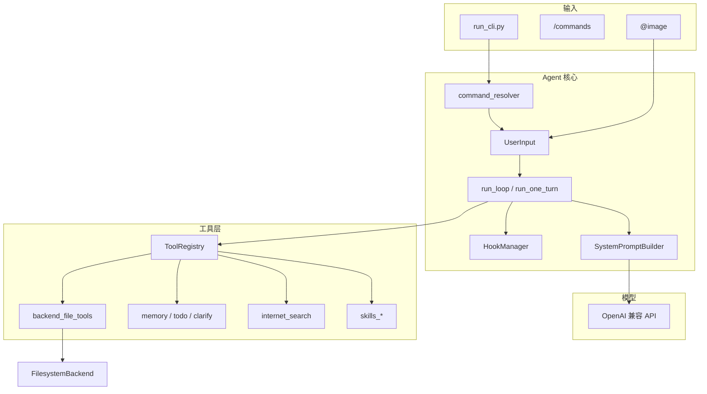

# Zeno Agent

面向 OpenAI 兼容 API 的轻量级 Agent 框架：工具调用循环、可插拔 Hook、Skills / 斜杠命令、虚拟文件系统与多模态等。


代码结构尽量清晰、模块边界明确：你可以从 Agent 循环、工具注册、Hook 、MCP、Skills、SubAgent等核心原理，理解「模型 → 工具 → 再推理」的完整链路；也可以在此基础上扩展工具、Skills、命令与接入方式，作为个人或团队 Agent 项目的起点。

---

## 特性


| 能力              | 说明                                                                                    |
| --------------- | ------------------------------------------------------------------------------------- |
| **Agent 循环**    | 多轮 `tool_calls` 直至结束；`run_loop` 以事件流输出，便于 CLI / 未来 SSE                                |
| **工具注册表**       | 统一 schema、分发与可选 `check_fn`；支持依赖注入（memory、todo、filesystem 等）                           |
| **虚拟文件系统**  | 基于 `BackendProtocol` 的读/写/编辑/grep/glob/上传/下载；虚拟绝对路径、路径校验与截断提示                         |
| **Skills**      | `skills/**/SKILL.md`（agentskills.io 风格）；`skills_list` / `skill_view` / `skill_manage` |
| **斜杠命令**        | `/命令名` 展开 `commands/*.md`                           |
| **Hook 体系**     | Session / Loop / PreModel / WrapModel / Tool 等生命周期扩展点                                 |
| **多模态**         | CLI 使用 `@image <路径>` 附加本地图片（PNG/JPEG/WebP/GIF），自动压缩与 data URL                         |
| **MCP（可选）**     | `agent/mcp` 支持 MCP 工具发现与 OAuth；CLI 默认注释，可按需启用                                         |
| **内置 Skills 库** | `research` / `github` / `email` / `creative` / `examples` 等分类示例                       |


---

## 声明

### 项目状态

Zeno Agent 处于**早期实验阶段**：核心 Agent 循环、工具注册、文件 Harness、Skills / 斜杠命令、Hook 与多模态 CLI 已可跑通，但距离「可长期日常使用的生产级助手」仍有明显差距。**欢迎有兴趣的开发者一起参与开发与共建**；在能力成熟前，API 与行为可能变动。

### 致谢与参考

本仓库在设计与实现上借鉴了多个开源/产品形态，**并非**它们的 fork 或官方替代品。其中，**Hermes** 主要影响了工具注册与分发、`ToolRegistry` 形态，以及 MCP 工具发现、Schema 转换与 OAuth 等相关实现；**LangChain DeepAgents** 主要影响了 `BackendProtocol` 文件后端抽象（读/写/编辑/grep/glob 等 Harness）。此外，在终端 Agent 交互、分层指令、Skills 等思路上也参考了 Claude Code、OpenCode、Agent Skills 与 Cursor 等常见实践。


### 当前局限（使用前请知悉）

| 模块 | 现状 |
| ---- | ---- |
| **系统提示** | `SystemPromptBuilder` 已支持分段组装与 `agent.md` 链，但 Skills / Memory **尚未**注入系统提示（代码中仍为注释）；无提示快照、缓存与增量更新 |
| **CLI** | `agent/run_cli.py` 仅用于快速验证，暂时使用print/input替代：无会话恢复、无 `--session-id`（待实现）、历史仅存内存；MCP 默认关闭（可取消注释进行手动开启） |
| **系统 Harness** | 无上下文压缩与窗口预算管理；无细粒度权限/沙箱策略；工具失败后的统一重试与降级策略仍较粗糙 |
| **文件 Harness** | 已有路径校验与结果截断，但设备文件黑名单、大文件分段提示、重复读取去重等**未实现** |
| **HTTP API** | `api/` 目录为预留，尚无对外服务与 SSE 网关 |

### 规划方向（尚未开始）

- **多智能体**：动态配置、子 Agent 派生、生命周期与结果汇总
- **调度与自动化**：定时任务、后台运行、会话持久化
- **环境与交互扩展**：Computer-Use、Browser-Use、更完整的 MCP 开箱启用
- **工程化**：Langfuse 等可观测性深度集成、错误恢复策略、权限模型

上述能力会随 Issue / PR 逐步推进；


## 架构概览




---

## 快速开始

### 环境要求

- [uv](https://docs.astral.sh/uv/)（推荐）或 pip

### 安装 uv

若尚未安装 [uv](https://docs.astral.sh/uv/)，可按平台执行：

**macOS / Linux**

```bash
curl -LsSf https://astral.sh/uv/install.sh | sh
```

安装完成后，按终端提示将 `~/.cargo/bin` 或 `~/.local/bin` 加入 `PATH`。例如：

```bash
echo 'source "$HOME/.local/bin/env"' >> ~/.bashrc
source ~/.bashrc
```

（若使用 zsh，将 `~/.bashrc` 改为 `~/.zshrc`。）

**Windows**

```powershell
powershell -ExecutionPolicy ByPass -c "irm https://astral.sh/uv/install.ps1 | iex"
```

安装后重新打开终端，执行 `uv --version` 确认可用。

### 安装项目

```bash
git clone https://github.com/zeno-sys/zeno-agent.git
cd zeno-agent
uv sync
```

### 配置

复制环境变量模板并填写密钥（**勿将你的 `.env` 提交到仓库**）：

```bash
cp .env.example .env
```

### 大模型 API 推荐（硅基流动）

本地快速跑通时，可使用 [硅基流动](https://cloud.siliconflow.cn/i/LM7uIvaJ) 的 OpenAI 兼容接口：**新用户注册通常有免费额度**，可在控制台创建 API Key 后直接试用：

```bash
OPENAI_API_KEY=你的_API_Key
OPENAI_BASE_URL=https://api.siliconflow.cn/v1
MODEL_NAME=Qwen/Qwen3.5-122B-A10B
```

推荐模型 **`Qwen/Qwen3.5-122B-A10B`**：同时支持**工具调用**、**长上下文**与**多模态**（视觉理解），与 `.env.example` 默认配置一致；CLI 中 `@image` 可直接配合该模型使用，无需另选 vision 专用模型。

主要变量：


| 变量                                | 说明                          |
| --------------------------------- | --------------------------- |
| `OPENAI_API_KEY`                  | 大模型 API Key                 |
| `OPENAI_BASE_URL`                 | OpenAI 兼容网关地址               |
| `MODEL_NAME`                      | 对话模型（推荐型号已支持 tools + 多模态） |
| `TAVILY_API_KEY`                  | 联网搜索（可选）                    |
| `EMBEDDINGS_*` / `RERANKER_MODEL` | 记忆与检索相关（按需）                 |
| `MULTIMODAL_*`                    | 图片大小、数量、最长边等限制              |


### 启动 CLI

```bash
uv run python agent/run_cli.py
```

交互提示：

- 输入问题后回车，Agent 流式输出工具调用与回复
- 使用 `**/help**` 查看斜杠命令列表（示例：`/say_hello`）
- 使用 **`@image path/to.png`** 在同一条消息中附带图片（默认 `Qwen/Qwen3.5-122B-A10B` 已支持）
- 输入 `**q**`、`exit` 或空行退出

---

## 项目结构

```
zeno-agent/
├── agent/              # 核心：循环、上下文、Hook、命令、MCP、工具注册
│   └── run_cli.py      # CLI 入口
├── tools/              # 内置工具实现与注册
├── backends/           # 文件后端（FilesystemBackend 等）
├── hooks/              # 默认 Hook（日志、打印、推荐追问等）
├── skills/             # 领域技能（SKILL.md）
├── commands/           # 斜杠命令 Markdown
├── model_layer/        # 模型调用中间层（路由、Provider、中间件）
├── utils/              # 消息规范化、图片压缩、终端美化等
├── tests/              # pytest 测试
├── docs/               # 设计文档
└── api/                # HTTP API（预留）
```

更细的设计说明见：

- [模型调用中间层设计](model_layer/DESIGN.md)
- [斜杠命令设计](agent/command/DESIGN.md)
- [工具开发指南](tools/TOOL_DEVELOPMENT.md)
- [多模态设计](docs/多模态图片能力设计.md)
- [测试说明](tests/TESTING.md)

---

## 内置工具一览


| 工具集            | 工具                                                                                                                     | 用途           |
| -------------- | ---------------------------------------------------------------------------------------------------------------------- | ------------ |
| `search`       | `internet_search`                                                                                                      | Tavily 联网搜索  |
| `todo`         | `todo`                                                                                                                 | 多步骤任务计划      |
| `memory`       | `memory`                                                                                                               | 跨会话记忆读写      |
| `clarify`      | `clarify`                                                                                                              | 向用户澄清选项      |
| `skills`       | `skills_list`, `skill_view`, `skill_manage`                                                                            | 发现与维护 Skills |
| `backend_file` | `list_directory`, `read_file`, `grep_files`, `glob_files`, `write_file`, `edit_file`, `upload_files`, `download_files` | 工作区文件操作      |


自定义工具：阅读 [tools/TOOL_DEVELOPMENT.md](tools/TOOL_DEVELOPMENT.md)，在 `tools/` 实现 handler 并在 `tools/__init__.py` 的 `register_all_tools()` 中注册。

---

## Skills 与斜杠命令

**Skills**（模型按需调用）

- 目录：`skills/<category>/<skill-name>/SKILL.md`
- 通过 `skills_list` / `skill_view` 加载说明与附属文件
- 内置分类示例：`research`、`github`、`email`、`creative`

**斜杠命令**（用户显式触发）

- 目录：`commands/*.md`、项目根 `./commands/`、`.cursor/commands/`
- 示例：`/say_hello` → 将命令正文展开为 `user` 消息

二者职责对比见 [agent/command/DESIGN.md](agent/command/DESIGN.md)。

---

## Hook 扩展

在 `AgentContext.hook_manager` 上注册 Hook，可介入例如：

- `SessionStart` / `SessionEnd`
- `LoopStart` / `LoopEnd` / `WrapLoop`
- `PreModelCall`（拦截或改写 messages / tools）
- `WrapModelCall`（包装流式请求）
- `PostModelCall`、工具调用前后打印等

默认实现见 `hooks/`；CLI 在 `agent/run_cli.py` 中注册常用 Hook。

---

## MCP 集成（可选）

`agent/mcp/mcp_tool.py` 提供 MCP 工具发现、Schema 转换与 OAuth 管理。在 `run_cli.py` 中取消注释即可启用：

```python
from agent.mcp.mcp_tool import discover_mcp_tools
discover_mcp_tools()
```

---

## 测试

```bash
# 全部测试
uv run pytest

# 指定文件
uv run pytest tests/test_backend_file_tools.py -v
```

---

---

## 贡献

1. Fork 本仓库并创建分支
2. `uv sync` 安装依赖
3. 修改后运行 `uv run pytest`
4. 提交 Pull Request

提交前请确保未包含 `.env`、日志、`data/logs/` 等敏感或本地产物（参见 [.gitignore](.gitignore)）。

---

## 许可证

本项目采用 [MIT License](LICENSE)，Copyright (c) 2026 zeno-sys。

---

## 相关链接

- [Agent Skills 规范](https://agentskills.io)
- [Model Context Protocol](https://modelcontextprotocol.io)
- [uv 文档](https://docs.astral.sh/uv/)

