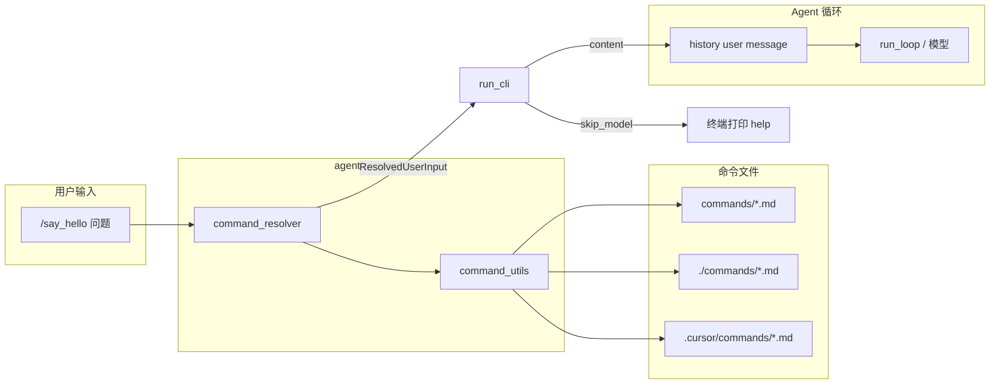

# 斜杠命令模块（`agent/command`）设计说明

## 1. 目标与定位

用户通过 **`/命令名`** 或 **`/命令名 补充文字`** 触发预置工作流，将 Markdown 命令文件展开为发给模型的 `user` 消息，而无需每次手写长提示词。

| 能力 | Skills（`load_skill`） | Commands（`/…`） |
|------|------------------------|------------------|
| 触发方式 | 模型按需调用工具 | 用户显式输入 `/` |
| 内容进入上下文 | 工具返回后注入 | 本轮 `user` 消息直接展开 |
| 典型用途 | 领域知识、API 说明 | 固定流程、检查清单、风格约束 |
| 存储 | `skills/**/SKILL.md` | `commands/*.md`、`.cursor/commands/*.md` |

命令模块只做 **发现 → 解析 → 展开**；不调用模型、不注册为 Tool。

## 2. 目录与命名

```
agent_framework/
├── agent/command/          # Python 包
│   ├── command_utils.py    # 扫描与解析
│   ├── command_resolver.py # / 输入展开
│   └── DESIGN.md           # 本文档
├── commands/               # 框架内置命令 Markdown（*.md）
└── .cursor/commands/       # 可选：与 Cursor IDE 命令目录兼容
```

- **`agent/command`**：代码包。
- **`commands/`**：命令资源目录（复数），与 `skills/` 并列。

## 3. 架构



### 3.1 `command_utils.py`

| 符号 | 职责 |
|------|------|
| `CommandSpec` | `name`、`body`、`description`、`source_path` |
| `get_commands_dirs()` | 返回扫描根目录列表（见 §4） |
| `parse_command_file` / `load_command` | 解析单个 `.md` |
| `discover_commands()` | 合并为 `Dict[str, CommandSpec]` |
| `is_help_command` | 内置 `help` / `commands` |

复用 `agent.skill.skill_utils.parse_frontmatter`，与 Skills 的 frontmatter 规则一致。

### 3.2 `command_resolver.py`

| 符号 | 职责 |
|------|------|
| `ResolvedUserInput` | 展开结果与元数据（是否命令、是否跳过模型等） |
| `resolve_user_input` | 入口：普通文本原样返回；`/…` 走展开逻辑 |
| `format_commands_help` | `/help` 列表文案 |
| `_cached_commands` | 进程内 `lru_cache`；`refresh=True` 或 `refresh_commands_cache()` 可刷新 |

### 3.3 集成点

当前唯一生产入口：`agent/run_cli.py` 读入用户行后：

1. `resolve_user_input(query)`
2. `skip_model` → 打印后 `continue`（help、未知命令）
3. 否则 `history.append({"role": "user", "content": resolved.content})`
4. 成功触发时 CLI 打印 `print_command_invoked(name)`

HTTP/API 等其它入口若需支持 `/`，应在写入 `state.messages` **之前** 同样调用 `resolve_user_input`。

## 4. 命令发现与覆盖

`get_commands_dirs()` 按顺序扫描，**同名命令以后出现的目录覆盖先前的**：

1. `agent_framework/commands/`（框架内置）
2. 当前工作目录 `commands/`（与内置路径相同时去重）
3. 当前工作目录 `.cursor/commands/`（Cursor 兼容）

每个目录下仅扫描 **顶层** `*.md`（不递归子目录）。

## 5. 命令文件格式

### 5.1 命令名解析优先级

1. YAML frontmatter 的 `name`
2. 正文首行 Cursor 风格标题：`# command-name`
3. 文件名（不含扩展名），如 `say_hello.md` → `say_hello`

### 5.2 描述（用于 `/help`）

1. frontmatter `description`
2. 否则取正文第一条非空、非 `#` 标题行
3. 超过 200 字符截断

### 5.3 示例

```markdown
---
name: create-tests
description: 在 tests/ 下编写 pytest
---

# create-tests

在 `agent_framework/tests/` 编写 pytest……
```

最小示例（`commands/say_hello.md`）：

```markdown
# say_hello

请在每次回答问题前，都加上 Hello。
```

## 6. 用户输入与展开规则

输入须匹配：`^/([\w-]+)(?:\s+([\s\S]*))?$`（整行 trim 后）。

### 6.1 内置元命令

| 输入 | 行为 |
|------|------|
| `/help`、`/commands` | `skip_model=True`，终端打印命令列表 |
| 未知 `/foo` | `skip_model=True`，提示未知并附带 help |

### 6.2 正文展开（`_expand_body`）

设 `body` 为命令正文，`args` 为命令名后的文字（可为空）。

| 条件 | 发给模型的 `content` |
|------|----------------------|
| `body` 含 `$ARGUMENTS` | 将占位符替换为 `args`（可多处） |
| `args` 为空 | 仅 `body` |
| `args` 非空且无占位符 | 结构化分块（见下） |

**有补充文字时的结构化模板**（避免把用户问题埋在「用户补充」里导致模型误判）：

```text
用户触发了斜杠命令 `/{name}`。请按「命令说明」执行约束；「用户消息」是用户本轮的真实问题或任务，优先据此回答。

<命令说明>
{body}
</命令说明>

<用户消息>
{args}
</用户消息>
```

示例：`/say_hello 这个命令里写的啥` → 模型应优先回答「用户消息」，同时遵守「命令说明」中的 Hello 约束。

### 6.3 `ResolvedUserInput` 字段

| 字段 | 含义 |
|------|------|
| `content` | 写入历史的文本，或 help 文案 |
| `is_command` | 是否以 `/` 解析为命令 |
| `command_name` | 解析出的命令名 |
| `is_help` | 是否为 help 元命令 |
| `unknown_command` | 未知命令名（若有） |
| `skip_model` | `True` 时不进入 `run_loop` |

## 7. 与 Skills 的协作边界

- 命令正文可写「请先 `load_skill` …」，但模块 **不会** 自动加载 Skill。
- 不在 system prompt 中枚举命令列表（避免与 Skills 索引重复占 token）；发现依赖 `/help` 或文档。
- 需要平台/路径过滤时，可后续在 frontmatter 增加与 `skill_utils.skill_matches_platform` 类似的字段（当前未实现）。

## 8. 缓存与热更新

- `discover_commands()` 每次全量扫描磁盘；`resolve_user_input` 默认读缓存。
- 开发时修改命令文件后，测试或调用方传 `refresh=True`，或调用 `refresh_commands_cache()`。
- CLI 长会话中修改命令文件 **不会** 自动刷新，需重启进程或显式刷新（后续可在 SessionStart hook 清缓存）。

## 9. 测试

`tests/test_command.py` 覆盖：

- Cursor 标题与 frontmatter 解析
- 内置 `say_hello` 发现与无参展开
- 有参结构化分块（含断言无「用户补充」旧格式）
- `$ARGUMENTS` 替换
- help / 未知命令 / 普通输入

运行：`python -m pytest tests/test_command.py -v`（在 `agent_framework` 根目录）。

## 10. 后续扩展（未实现）

按优先级可考虑的增强：

1. **`config.yaml` 的 `commands.external_dirs`**：与 `skills.external_dirs` 对称。
2. **SessionStart 清缓存**：长会话改命令文件后自动生效。
3. **系统提示词可选索引**：简短列出命令名 + 一行描述（注意 token）。
4. **子目录递归或分类**：`commands/foo/bar.md`。
5. **非 CLI 入口统一预处理 Hook**：`UserInputHook`，避免各入口重复调用 `resolve_user_input`。

## 11. 公开 API

```python
from agent.command import (
    resolve_user_input,
    ResolvedUserInput,
    discover_commands,
    format_commands_help,
    get_commands_dirs,
    load_command,
)
```

新增入口或 UI 时，以 `resolve_user_input` 为唯一展开入口，保持与 CLI 行为一致。
